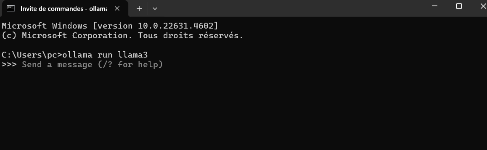
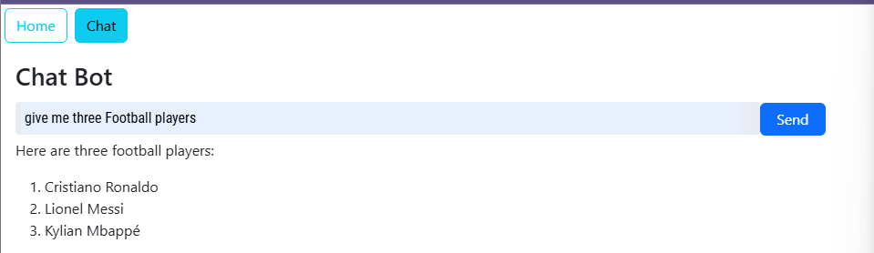
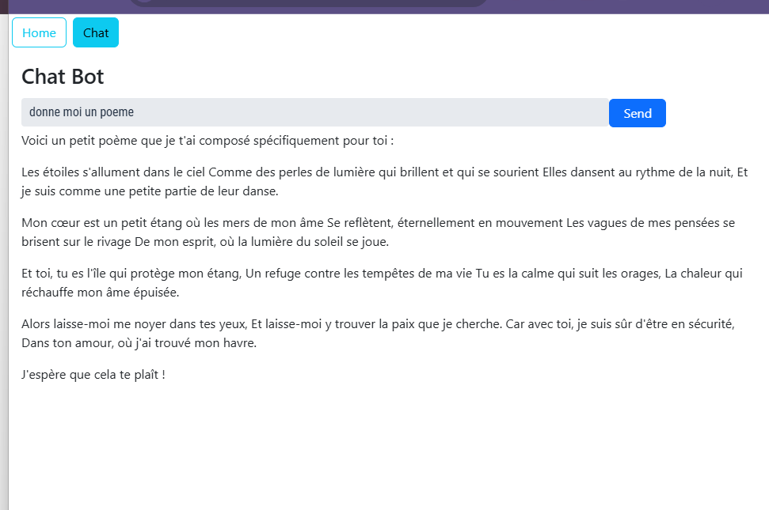
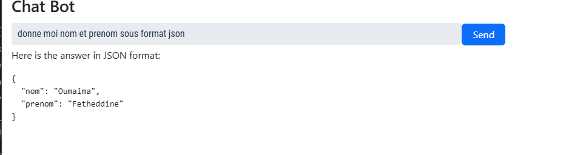
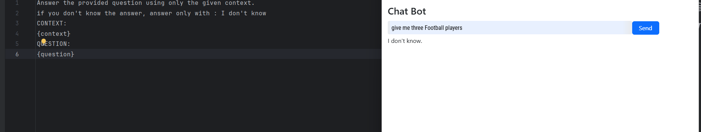

<h1>CHATBOT - with Spring AI- React - Vaadin - RAG - Llama-Open AI</h1>

Ce projet consiste à développer un micro-service de chatbot intelligent en utilisant l'architecture RAG. Il combine des technologies modernes de NLP (traitement du langage naturel) et de recherche d'information pour créer un système capable de fournir des réponses précises et contextuelles. Ce type de chatbot est idéal pour des applications nécessitant une interaction naturelle et une forte dépendance à une base de connaissances spécifique.

---

### Chatbot:
- **Deux Modes**:
  - Mode Question Générale: Répond aux questions des utilisateurs en utilisant un modèle de langage.
    
  
  
  
  - Mode Question PDF: Répond aux questions basées sur le contenu d'un fichier PDF local.

----
Auteur:
----
Realisé par:  
RIZKI Mohamed Amine  
SERNANE Yahya  
EL MALKY Douaa  
AHCHOUCHE Firdawsse  
FETH-EDDINE Zineb  
MALEK Jihane  
